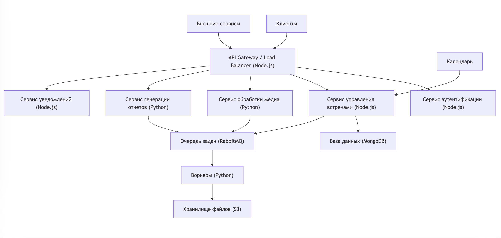

# Архитектура mymeet.ai

## Обзор

mymeet.ai - это сервис для автоматической записи и протоколирования онлайн-встреч бизнеса на основе ИИ. Архитектура построена на принципах микросервисов, используя Node.js и Python для различных компонентов системы.

## Компоненты системы

### 1. API Gateway / Load Balancer (Node.js)

- **Технология**: Node.js с Express.js или Fastify
- **Функции**: Маршрутизация запросов, балансировка нагрузки, базовая аутентификация
- **Улучшения**: Внедрение кэширования (Redis), реализация rate limiting
- **Узкие места**: Может стать узким местом при очень высокой нагрузке

### 2. Сервис аутентификации (Node.js)

- **Технология**: Node.js с Passport.js для аутентификации
- **Функции**: Управление пользователями, аутентификация, авторизация
- **Улучшения**: Внедрение JWT для безопасной передачи токенов, поддержка OAuth для сторонних сервисов
- **Узкие места**: Потенциальная цель для атак, требует особого внимания к безопасности

### 3. Сервис управления встречами (Node.js)

- **Технология**: Node.js с Mongoose ODM для работы с MongoDB
- **Функции**: Планирование встреч, интеграция с календарями, управление записями встреч
- **Улучшения**:
    - Оптимизация схем Mongoose для эффективной работы с MongoDB
    - Использование агрегаций MongoDB для сложных запросов
- **Узкие места**:
    - Обеспечение согласованности данных при сложных операциях
    - Синхронизация данных между различными календарными системами

### 4. Сервис обработки медиа (Python)

- **Технология**: Python с библиотеками FFmpeg-python для обработки медиа и SpeechRecognition для транскрибирования
- **Функции**: Запись аудио/видео, транскрибирование, обработка загруженных файлов
- **Улучшения**: Использование GPU для ускорения обработки видео (например, с помощью PyTorch)
- **Узкие места**: Высокие требования к вычислительным ресурсам, особенно при обработке видео высокого разрешения

### 5. Сервис генерации отчетов (Python)

- **Технология**: Python с PyMongo для работы с MongoDB, библиотеки NLTK или spaCy для NLP
- **Функции**: Анализ транскриптов, создание структурированных отчетов
- **Улучшения**:
    - Использование агрегаций MongoDB для предварительной обработки данных
    - Кэширование часто используемых данных для ускорения генерации отчетов
    - Внедрение машинного обучения для улучшения качества отчетов (например, с использованием scikit-learn)
- **Узкие места**:
    - Эффективность обработки больших объемов неструктурированных данных
    - Качество и точность генерируемых отчетов, особенно для сложных или технических обсуждений

### 6. Сервис уведомлений (Node.js)

- **Технология**: Node.js с библиотекой Nodemailer для email и node-pushnotifications для push-уведомлений
- **Функции**: Отправка email, push-уведомлений, интеграция с мессенджерами
- **Улучшения**: Использование шаблонизатора (например, Handlebars) для создания персонализированных уведомлений
- **Узкие места**: Задержки при массовой рассылке, проблемы с доставкой из-за спам-фильтров

### 7. База данных (MongoDB)

- **Технология**: MongoDB
- **Функции**: Хранение данных о пользователях, встречах, отчетах в документо-ориентированном формате
- **Улучшения**:
    - Использование индексов для оптимизации запросов
    - Настройка шардинга для горизонтального масштабирования
    - Внедрение репликации для повышения отказоустойчивости
- **Узкие места**:
    - Может потребовать тщательной настройки индексов для оптимальной производительности
    - Согласованность данных при использовании шардинга

### 8. Очередь задач (RabbitMQ)

- **Технология**: RabbitMQ с библиотеками amqplib для Node.js и Pika для Python
- **Функции**: Управление асинхронными задачами, балансировка нагрузки между воркерами
- **Улучшения**: Настройка кластера RabbitMQ для повышения отказоустойчивости
- **Узкие места**: Может переполниться при пиковых нагрузках

### 9. Воркеры (Python)

- **Технология**: Python с Celery для управления задачами
- **Функции**: Выполнение задач по обработке медиа, генерации отчетов
- **Улучшения**: Использование Celery Beat для планирования периодических задач
- **Узкие места**: Могут стать узким местом при недостаточном количестве или мощности

### 10. Хранилище файлов (S3)

- **Технология**: Amazon S3 или совместимое решение (например, MinIO)
- **Функции**: Хранение аудио/видео файлов, отчетов
- **Улучшения**: Настройка политик жизненного цикла объектов для автоматического архивирования старых данных
- **Узкие места**: Может стать дорогостоящим при большом объеме данных

## Общие улучшения для всей системы

1. Внедрение Docker и Kubernetes для контейнеризации и оркестрации сервисов
2. Использование Prometheus и Grafana для мониторинга и визуализации метрик
3. Внедрение ELK стека (Elasticsearch, Logstash, Kibana) для централизованного логирования
4. Использование Istio в качестве service mesh для улучшения наблюдаемости и управления трафиком
5. Внедрение CI/CD пайплайнов с использованием Jenkins или GitLab CI

## Потенциальные общесистемные узкие места

1. Сетевая латентность между сервисами, особенно при взаимодействии Node.js и Python сервисов
2. Согласованность данных в распределенной системе, особенно при использовании разных языков программирования
3. Сложность отладки и мониторинга в гетерогенной среде (Node.js и Python)
4. Управление версиями API между сервисами на разных языках

## Заключение

Данная архитектура обеспечивает высокую масштабируемость и гибкость, позволяя mymeet.ai эффективно обрабатывать различные сценарии использования и легко внедрять новые функции в будущем. Использование как Python, так и Node.js позволяет использовать сильные стороны обоих языков: Node.js для высокопроизводительных веб-сервисов и обработки событий, а Python для задач, связанных с обработкой данных, машинным обучением и анализом.